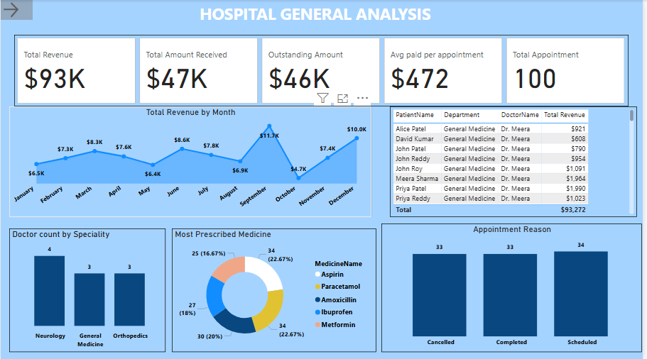
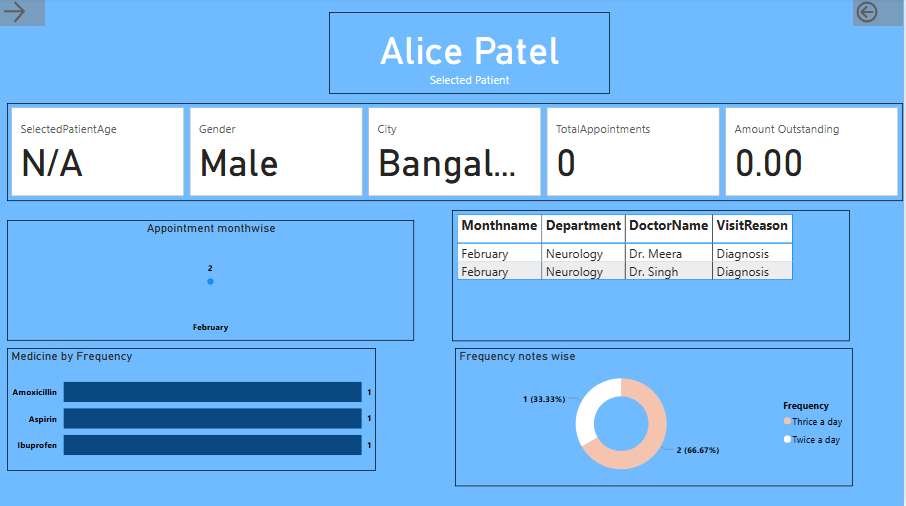
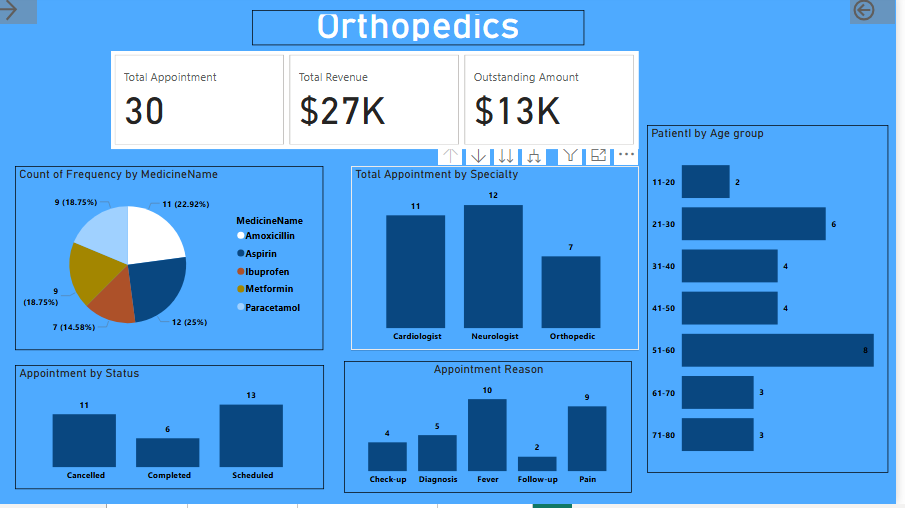
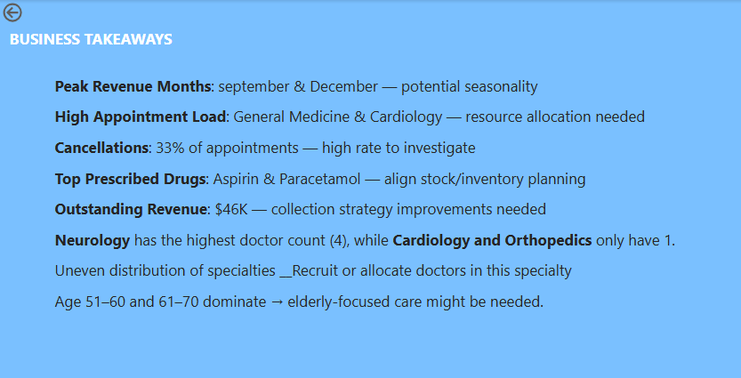

# 🏥 Hospital General Analysis - Power BI Dashboard

This Power BI project presents an interactive and insightful analysis of a general hospital's operations and financial metrics. It demonstrates business understanding, storytelling through visuals, and the use of advanced Power BI features like drillthroughs.

## 📊 Dashboard Highlights

### 1. **Main Dashboard**
- KPIs: Total Revenue, Appointments, Average per Appointment, Outstanding Amount
- Revenue trend by month
- Department-wise revenue and doctor performance
- Most prescribed medicines
- Appointment reasons breakdown

### 2. **Patient Drillthrough**
- Patient-wise details (Name, Gender, City, Appointments)
- Visit reasons, prescribed medicines, and frequency
- Filters enabled for custom patient views

### 3. **Department Drillthrough**
- Appointments, revenue, and outstanding by department
- Appointment status
- Medicine frequency
- Age group analysis

## 🔄 Drillthrough Functionality

Power BI drillthrough allows users to right-click and explore specific data.

- **Patient Drillthrough**: Right-click on a patient name → view their full appointment & prescription history.
- **Department Drillthrough**: Right-click on a department → view that department’s stats and KPIs.

## 📌 Business Takeaways

- **Peak Revenue Months**: September & December → seasonality observed
- **High Appointment Load**: Neurology & Orthopedics → resource need
- **Cancellations**: 33% → possible service issues
- **Top Prescribed Drugs**: Aspirin & Paracetamol → plan stock
- **Outstanding Revenue**: $46K → collection strategy improvement
- **Doctor Distribution**: Neurology has 4 doctors; others only 1
- **Demographics**: Elderly group (51–70) is dominant

## 🛠️ Tools Used

- Power BI Desktop
- Drillthrough Filters
- Slicers and DAX
- Page Navigation Buttons

## 📂 Files Included

- hospital general analysis.pbix
- dashboard1.png to Takeaways.png
- README.md

## 📷 Preview

